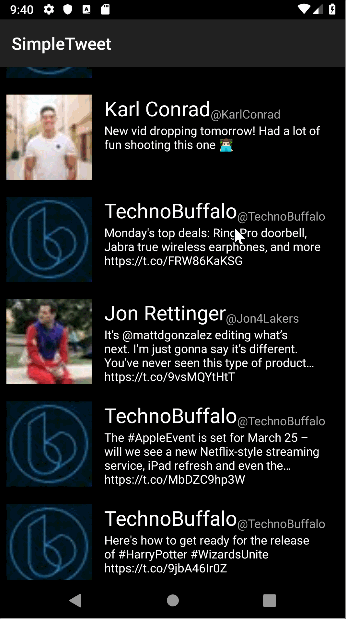

# Project 1 - *Simple ToDo*

**Simple ToDo** is an android app that allows building a todo list and basic todo items management functionality including adding new items, editing and deleting an existing item.

Submitted by: **Ung Jae Yun**

Time spent: **2** hours spent in total

## User Stories

The following **required** functionality is completed:

* [x] User can sign in to Twitter using OAuth login
* [x] User can view the tweets from their home timeline
* [x] User can refresh tweets timeline by pulling down to refresh

## Video Walkthrough

Here's a walkthrough of implemented user stories:

GIF created with [LiceCap](http://www.cockos.com/licecap/).

