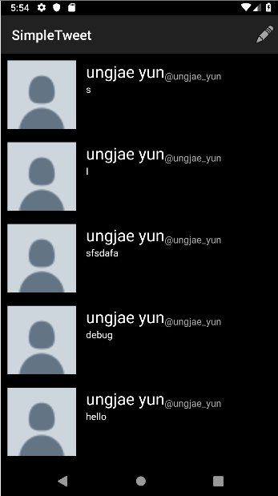

# Assignment 4 - *Simple Tweet*

**Simple Tweet** mimics the twitter app 

Submitted by: **Ung Jae Yun**

Time spent: **1.5** hours spent in total

## User Stories

The following **required** functionality is completed:

* [x] User can sign in to Twitter using OAuth login
* [x] User can view the tweets from their home timeline
* [x] User can refresh tweets timeline by pulling down to refresh
* [x] User can compose a new tweet

## Optional

* [x] Use Parcelable instead of Serializable using the popular Parceler library

## Video Walkthrough

Here's a walkthrough of implemented user stories:

GIF created with [LiceCap](http://www.cockos.com/licecap/).

